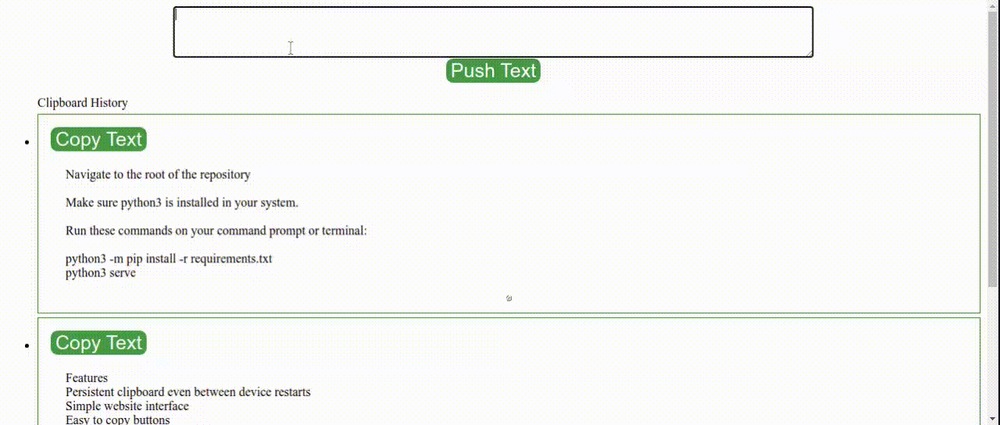

# Project Title

Simple overview of use/purpose.

## Description

We often copy something on one device and wish if we could paste it to some other device. Fast Copy is such a solution for you, Fast and less overhead.
All you need is your devices connected to the same network (router or direct mobile hotspot)

## Features

* Persistent clipboard even between device restarts
* Simple website interface
* Easy to copy buttons
* Fast
* Preserves white Space and Line Breaks
* Can save upto 100 clipboard history ( can be increased in the config.txt file)

## Demo 



## Getting Started

### Dependencies

* Supposed to support Windows, Linux and MAC OS

### Installing

* Install python3 in your machine if not preinstalled

### Executing program

* Navigate to the root of the repository
* Make sure python3 is installed in your system.
* Run these commands on your command prompt or terminal:

    ```
    python3 -m pip install -r requirements.txt
    python3 server.py
    ```

    (if it says pip not found install pip with following commands then run those commands)

    ```
    curl https://bootstrap.pypa.io/get-pip.py -o get-pip.py
    python3 get-pip.py
    ```

* Visit your browser on the displayed http link on the console. 
(Example: ----------------Visit http://X.X.X.X:5000 on browser-----------)

**Not only this laptop, but any device connected to the network or wifi.**


## Authors

Sayan Dey
[Mail To Sayan](mr.sayan.dey@gmail.com)

## Version History

* 1.0
    * Initial Release

## License

See the LICENSE.md file for details